## 🍄 프로젝트 구현 결과

jChecker 2.0 시스템의 기능은 웹 서비스 형태로 제공된다.  
**_React i18next (react-i18next)_** 라이브러리를 통해 영어 버전의 jChecker 2.0 서비스도 지원 가능하다.

<p align="center">
  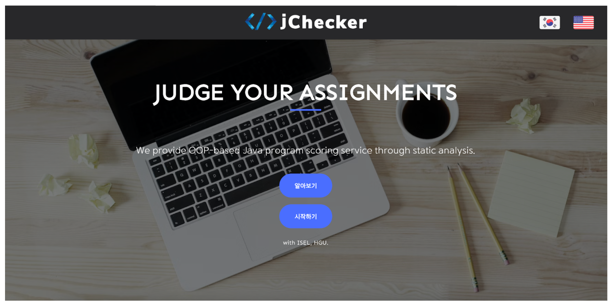
  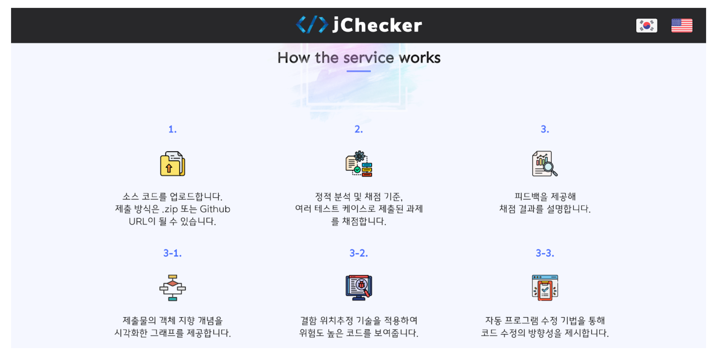
</p>

사용자가 jChecker 2.0 웹 페이지에 접속하면, 가장 먼저 볼 수 있는 화면이다. 우측 상단에 있는 아이콘 버튼을 통해 언어를 변경할 수 있다. 언어 변경 시 페이지 이동 없이 즉시 번역 가능하며, 선택한 언어의 버전으로 지속적인 서비스가 제공된다. <U>알아보기 (ABOUT)</U> 버튼을 통해 jChecker 2.0 서비스의 지원 기능과 동작 방법에 대한 설명 페이지를 조회할 수 있다.   

<br>

### ✏️ For Students

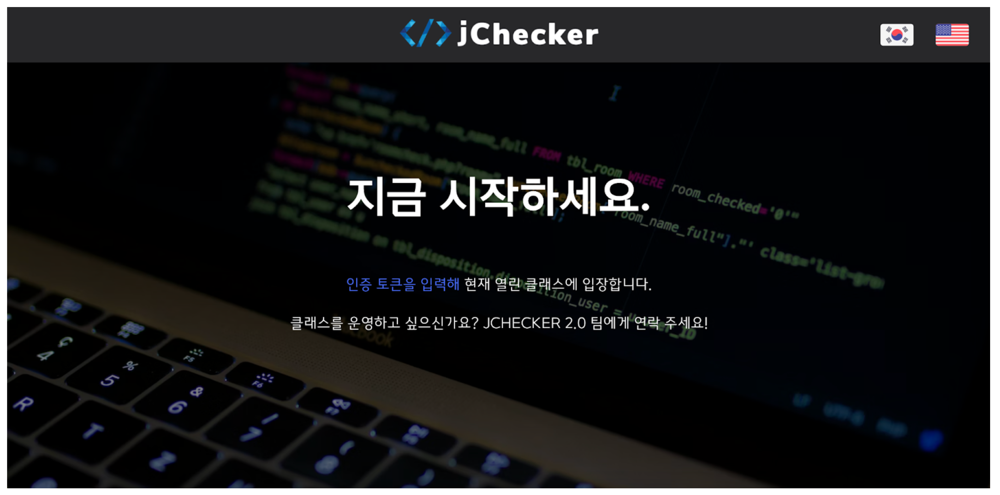

사용자 (학생)은 메인 페이지의 <U>시작하기 (GET STARTED)</U> 버튼을 통해 채점 서비스 시작 페이지를 조회할 수 있다. <U>인증 토큰을 입력해 (Enter the authentication token)</U> 텍스트를 클릭하여 클래스 입장 페이지로 이동한다.


<p align="center">
  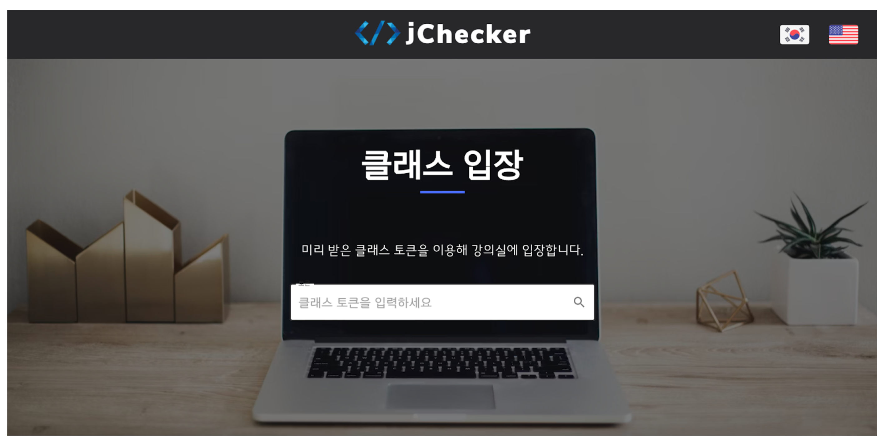
  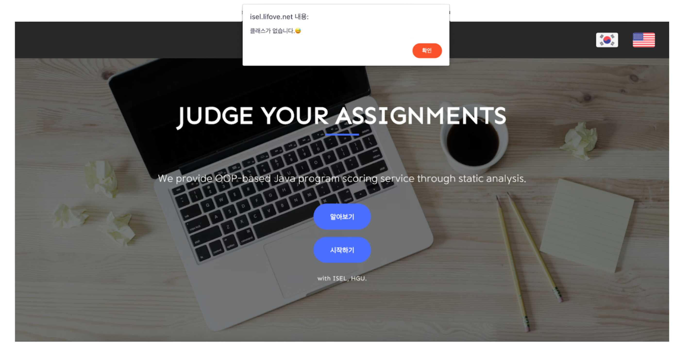
</p>

클래스 입장 페이지이다. 관리자에 의해 미리 공지된 토큰 정보를 입력하여 원하는 클래스에 입장할 수 있다. 이때 입력되는 토큰은 사용자를 위한 토큰이다. 해당 토큰 정보는 관리자가 새로운 클래스 생성 후 채점 정책을 등록한 시점에 생성된다. 사용자가 입력한 토큰에 대응되는 클래스가 존재하지 않는다면, 안내 메시지 <U>클래스가 없습니다. 😅</U> 를 출력하고 jChecker 2.0 서비스 메인 페이지로 이동한다.


<p align="center">
  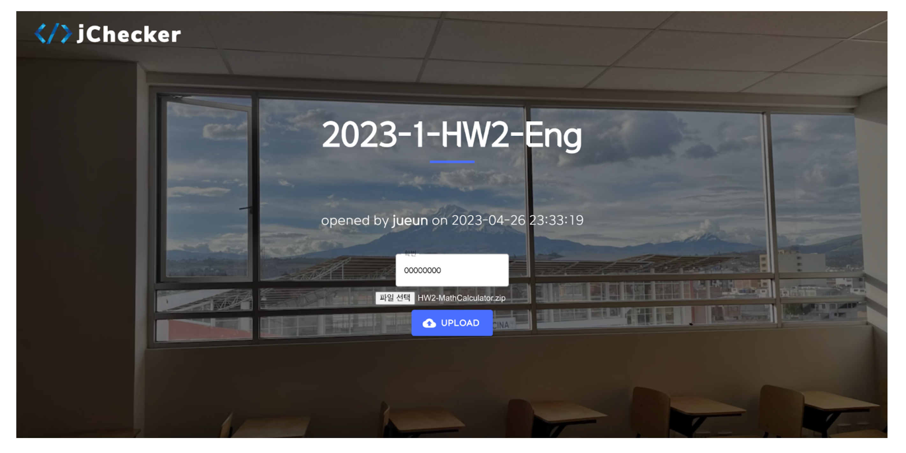
  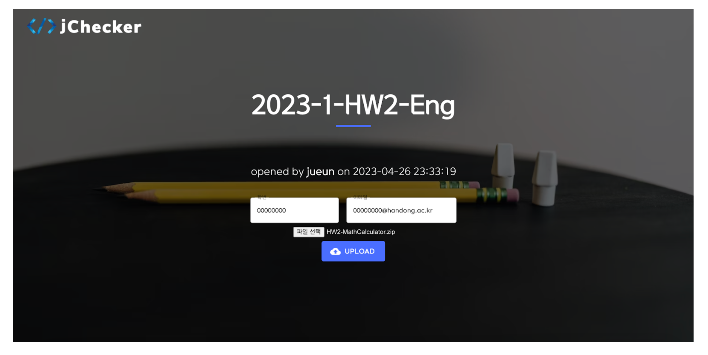
</p>

입력한 토큰 정보가 유효하다면, 토큰에 대응되는 클래스에 입장할 수 있다. 클래스 페이지는 클래스 이름, 클래스를 생성한 관리자 등의 클래스 정보를 보여준다. 사용자는 위 페이지에서 자신이 작성한 소스코드 파일 (.zip 확장자)을 제출한다. 클래스의 피드백 단계가 2단계 이하로 설정되어 있다면 학번을, 3단계로 설정되어 있다면 학번과 이메일 정보를 입력하고 파일을 선택해야 제출 버튼이 활성화된다.


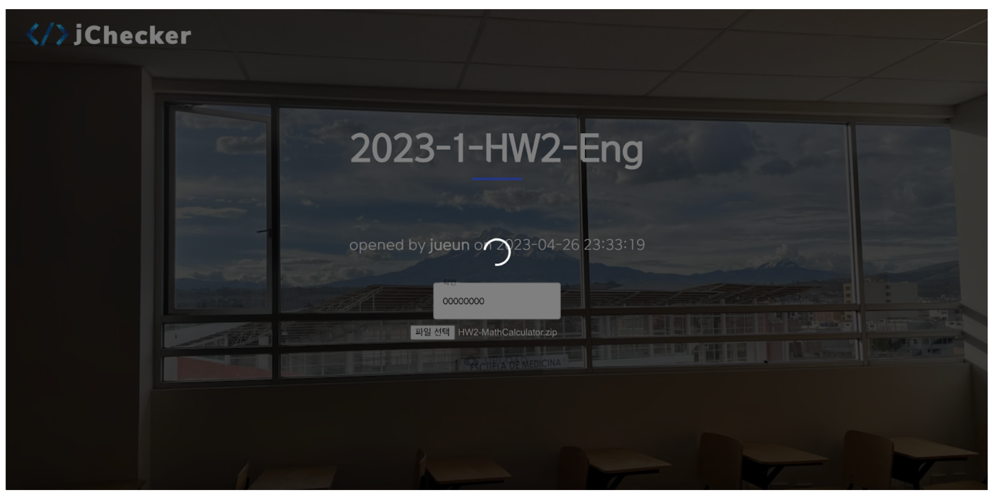

제출 버튼을 클릭하면, 실시간으로 채점이 진행된다. 위 화면은 채점 진행 중 사용자에게 제공되는 채점 페이지이다!   


<p align="center">
  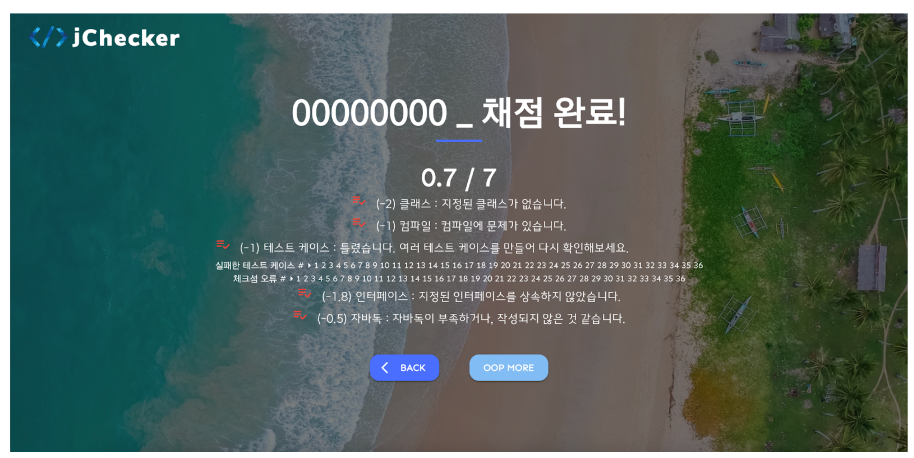
  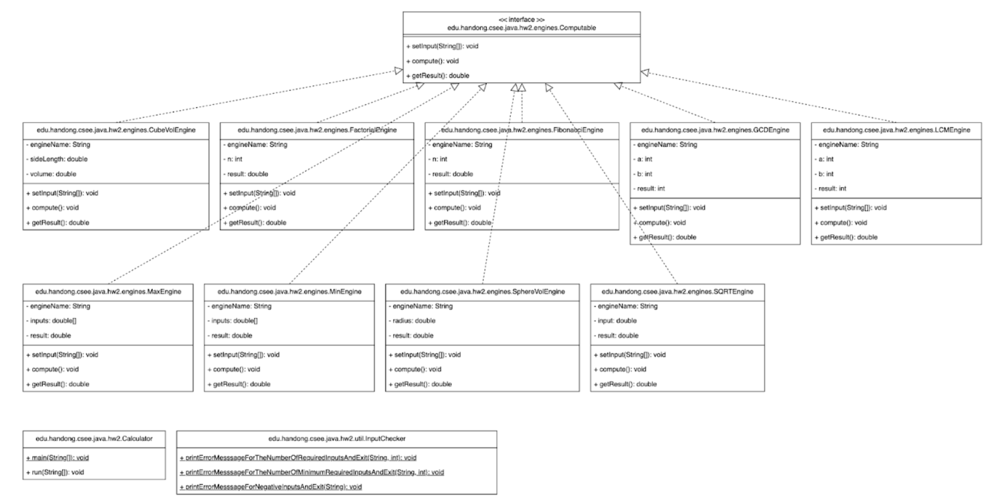
</p>

채점이 완료되면, 채점 결과 페이지로 이동한다. 채점 결과에 대한 피드백이 제공되며, 기본 피드백은 1단계이다. 1단계 피드백은 채점 결과와 클래스 다이어그램으로 구성되어 있다. 제출된 프로그램에 대한 클래스 다이어그램은 <U>OOP MORE</U> 버튼을 통해 조회할 수 있다. 


<p align="center">
  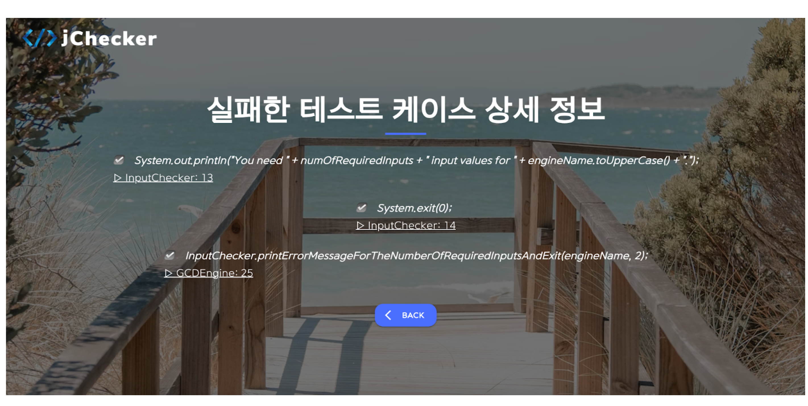
  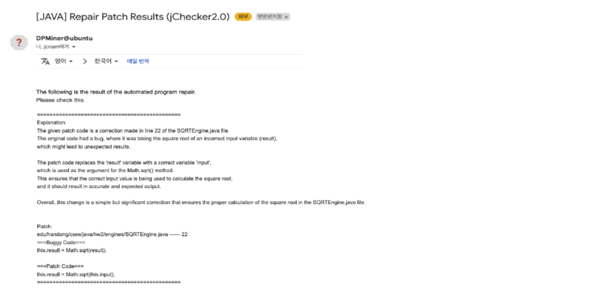
</p>

2단계 이상의 피드백은 디버깅에 필요한 정보를 추가적으로 제공한다. 테스트 케이스에 대한 감점이 있다면, <U>MORE</U> 버튼을 통해 결함 코드 정보를 볼 수 있다. 3단계 피드백은 해당 결함 코드의 수정 방법을 이메일로 전송한다.


<br>

### 🖍️ For Instructors

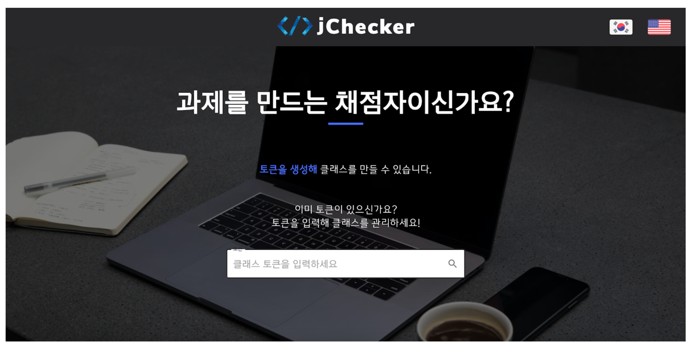

관리자를 위한 페이지는 별도로 존재한다. <U>토큰을 생성해 (Follow these steps)</U> 텍스트를 클릭하여 새로운 클래스를 생성하고, 그에 대한 채점 정책을 등록할 수 있다. 또한 토큰 정보를 입력하여 원하는 클래스에 입장할 수 있다. 이때 입력되는 토큰은 관리자를 위한 토큰이다.   


<p align="center">
  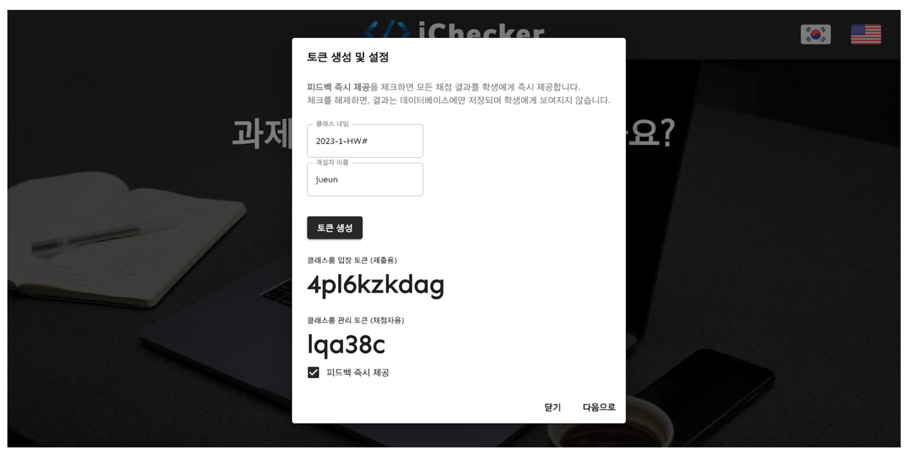
  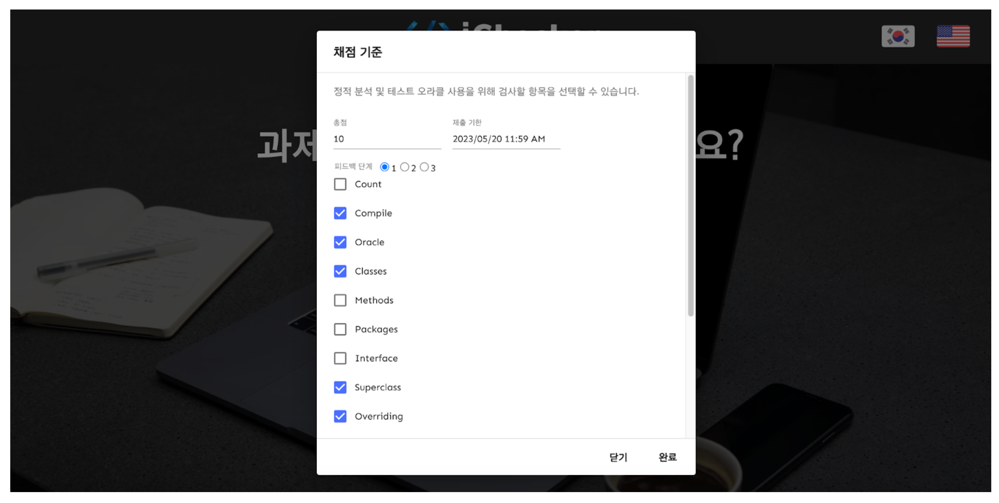
  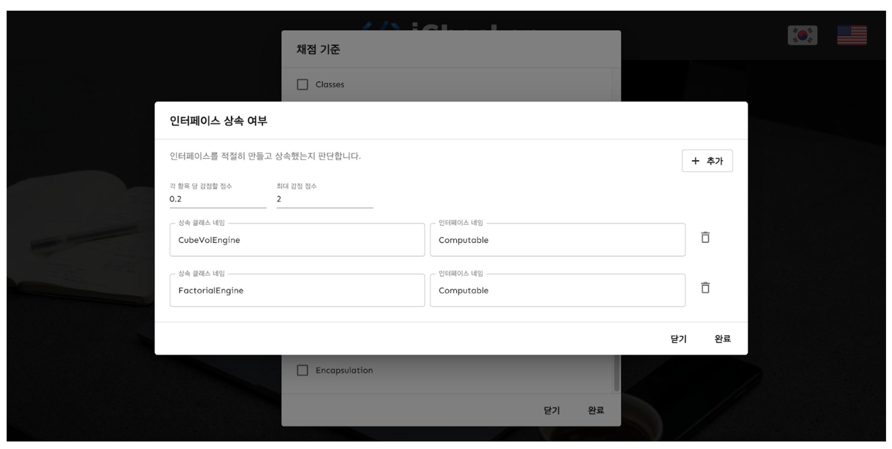
</p>

새로운 클래스 생성 시 클래스 이름과 클래스를 생성한 관리자 이름 정보를 입력하면, <U>토큰 생성 (GENERATE A TOKEN)</U> 버튼이 활성화된다. 해당 버튼을 클릭하면 클래스룸 입장 토큰 (사용자 토큰), 클래스룸 관리 토큰 (관리자 토큰)이 각각 10자리와 6자리 난수로 만들어진다. <U>피드백 즉시 제공 (Direct Feedback)</U>을 체크하면, 사용자에게 채점 결과에 대한 피드백이 제공된다. <U>다음으로 (NEXT)</U> 버튼을 클릭하면 세부 채점 정책을 작성할 수 있다. 총 12개의 객체 지향 개념 및 기타 구현 사항으로 이루어져 있다. 각 항목에 대한 케이스를 추가 및 삭제할 수 있으며, 감점 점수와 최대 감점 점수를 설정하여 정책을 등록한다.   


<p align="center">
  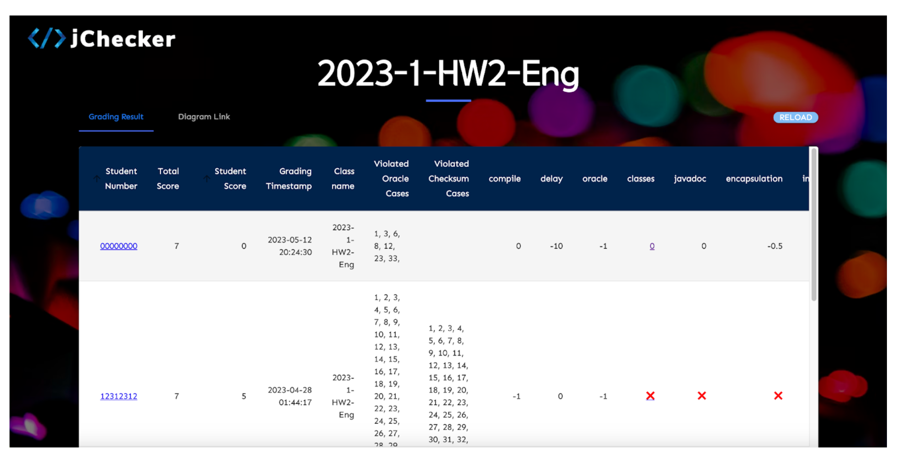
  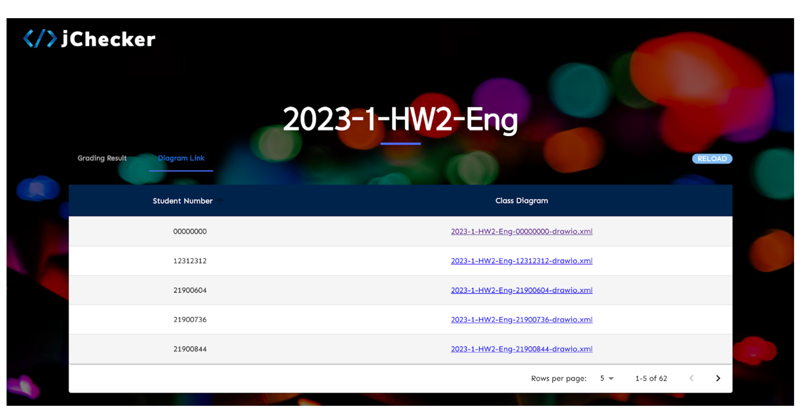
</p>

관리자는 토큰 정보를 사용하여 해당 클래스의 채점 기록과 각 사용자의 클래스 다이어그램을 데이터 테이블 형식으로 조회 가능하다. 테이블의 최대 행 개수 (5개, 10개, 25개)를 설정할 수 있으며, 테이블의 페이지를 넘어가면서 데이터를 확인할 수 있다. 사용자의 학번을 클릭하여 제출물을 다운로드 할 수 있으며, <U>classes</U> 부분의 데이터를 클릭하여 클래스 다이어그램을 조회할 수 있다. <U>RELOAD</U> 버튼은 테이블을 새로운 데이터로 업데이트 하는 역할을 한다.   


<p align="center">
  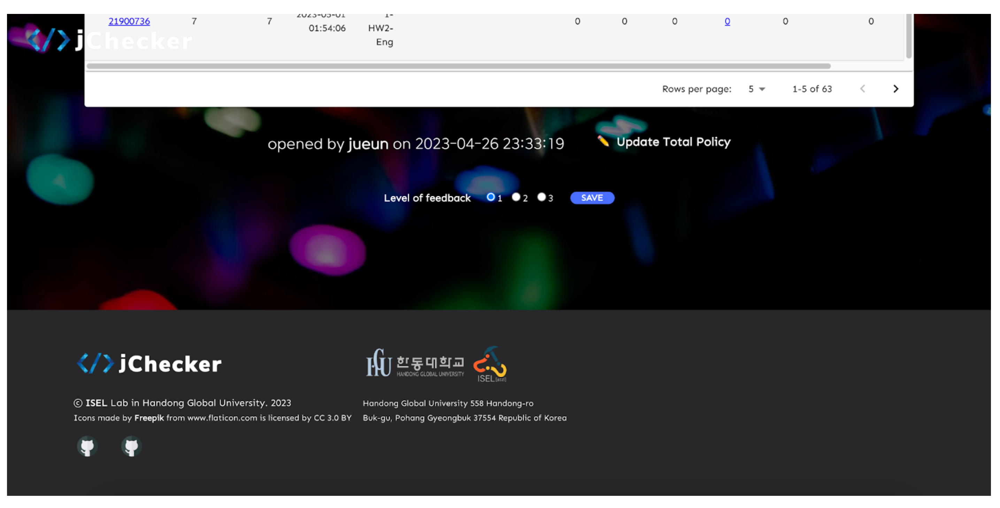
  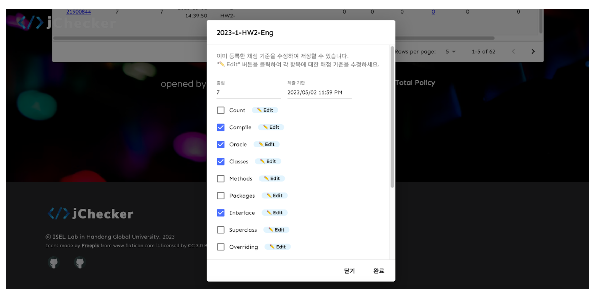
</p>

채점 기록 데이터 테이블 아래에는 채점 정책을 관리를 위한 버튼이 있다. <U>✏️Update Total Policy</U> 버튼을 클릭하여 이미 등록한 채점 정책을 수정할 수 있다. 체크 박스는 등록된 세부 채점 항목을 보여주며, <U>✏️Edit</U> 버튼을 통해 항목을 추가 및 삭제한다. <U>완료 (SUBMIT)</U> 버튼을 클릭하여 수정된 채점 정책을 저장한다.

<br><br>

## 🧪 프로젝트 실험

프로젝트의 설계 타당성과 성능을 평가하기 위한 실험을 진행하였다!   
학부 Java Programming 두 분반의 수업에서 jChecker 2.0 시스템을 사용하였다.   

### 🪵 실험 환경 및 설계
1단계 피드백 <span style="color: #808080">(프로그램 실행 결과/객체 지향 개념 평가 결과/Class diagram)</span>에 대한 실험 환경은 아래와 같다.

> * **Server 정보**: Ubuntu 18.04.6, 2.1GHz CPU, 32GB RAM, 512GB 메모리   
> * **Class 정보**
>   * Name: 2023-1-HW2-Kor, 2023-1-HW2-Eng
>   * Test-case: 36개 (출력값 및 결과 파일 생성 확인)
>   * Object-oriented Concepts: Required Classes (11개), Javadoc, Encapsulation, Inheritance (9개)
> * **기간**: 2023.04.26 - 2023.05.15
> * **동시 사용자**: 117명 (54 + 63)   

결함 위치추정 기법과 자동 프로그램 수정 기법이 적용된 2단계 및 3단계 피드백은 실행이 불안정하여 일회성 실험으로 진행하였다.   
2단계 및 3단계 피드백의 실험 환경은 아래와 같다.
> * **Server 정보**: Ubuntu 18.04.6, 2.1GHz CPU, 32GB RAM, 512GB 메모리
> * **Class 정보**
>   * Name: 2023-1-HW2-Kor
>   * Test-case: 36개 (출력값 및 결과 파일 생성 확인)
>   * Object-oriented Concepts: Required Classes (11개), Javadoc, Encapsulation, Inheritance (9개)
> * **기간**: 2023.05.18
> * **동시 사용자**: 1명

<br>

### 🏕 실험 결과

**1️⃣ <U>기본 피드백</U> <span style="color: #808080">(프로그램 실행 결과/객체 지향 개념 평가 결과/Class diagram)</span>**  
약 3개월의 기간 동안 여러 Java Programming 과제에 jChecker 2.0 시스템을 적용하였다. 그 결과, <span style='background-color: #fff5b1'>**100명 이상의 동시 사용자에게 서비스를 제공할 수 있음**</span>과 1단계 피드백에 적용되는 <span style='background-color: #fff5b1'>**모든 기능이 문제 없이 동작함**</span>을 확인할 수 있었다. 2023학년도 1학기에 진행된 Java Programming 수업은 모두 jChecker 2.0 시스템의 1단계 피드백을 사용하였다. 이로써 일정 기간 당안 여러 사용자에게 동시 다발적으로 서비스를 제공하여도 문제 없음을 증명하였다.   

**2️⃣&3️⃣ <U>디버깅 정보 피드백</U> <span style="color: #808080">(1단계 피드백 + 결함 코드/수정 방법)</span>**   
2단계 및 3단계 피드백 기능은 Refactoring, Class path 설정 등의 문제로 인해 <span style='background-color: #fff5b1'>**비교적 낮은 구현 완성도**</span>를 가진다. 이러한 이유로 실험 기간 동안 2단계와 3단계 피드백을 위한 실험을 하지 못하였다. 기능의 동작을 확인하기 위해 일회성 실험을 진행하였고, <span style='background-color: #fff5b1'>**디버깅 정보가 불규칙적으로 제공됨**</span>을 확인하였다. jChecker 2.0 시스템에 적용된 결함 위치추정 기법 (GZoltar)과 자동 프로그램 수정 기법 (TBar) 모두 Defects4J 등의 결함 데이터에 적합하여 사용자에 코드에서 좋은 성능을 보여주지 못한 것으로 판단된다.   


```toc

```
