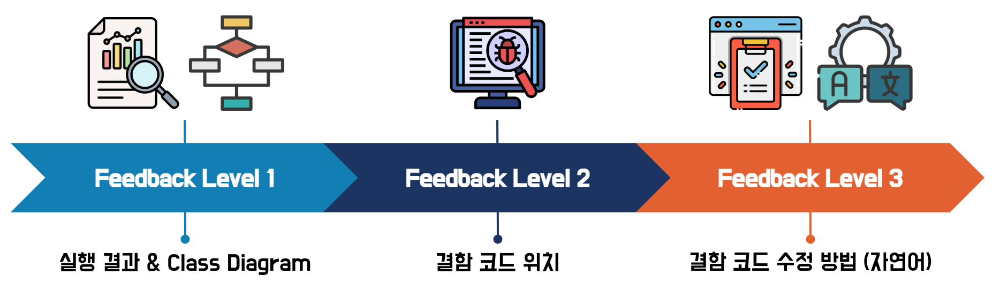
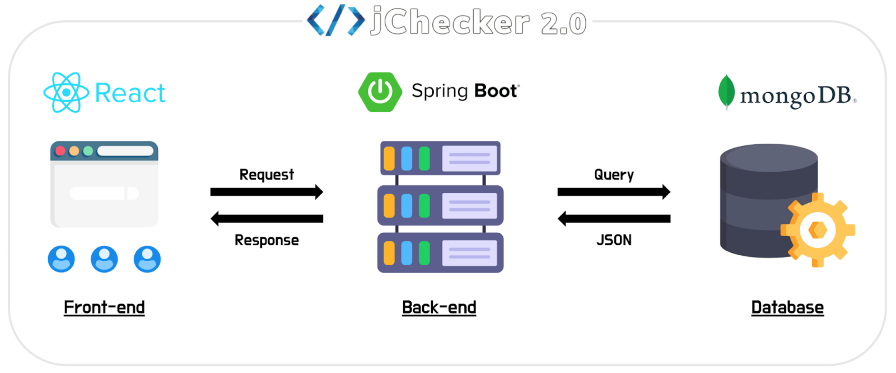

## 💭 고민의 시작

학생들이 프로그래밍 교육 과정에서 부담을 느끼는 부분 중 하나는 디버깅이다.  
프로그래밍 경험이 부족한 학생들은 결함 코드의 위치를 찾는 것, 해당 결함을 수정하는 것 모두 어려워 한다.  

Python, Java 등 다양한 언어의 프로그래밍 실습 수업에 TA로 참여하면서 가장 많이 받았던 질문은 두 가지였다.
1. ~이 안되는데, **왜 안되는지** 모르겠다
2. n번 라인에 문제가 있는 것 같은데, **어떻게 수정해야 하는지** 모르겠다


학생들의 프로그래밍 능력 향상을 위해서 디버깅에 필요한 정보를 제공해야 되지 않을까 🤔

> 이때, 디버깅 정보는 다음과 같다.  
> 결함 코드를 찾기 위한 Problem space, 특정 코드의 실제 결함 여부, 결함 코드 수정 방법

TA로서 많은 프로그램을 빠르게 분석하여 효과적인 피드백을 제공할 수 있는 방법이 없을까 🤔  
(+ 효과적인 피드백이란?)

<br>

### 🗺 해결 방안의 방향

디버깅에 필요한 정보를 포함하여 **맞춤형 피드백을 제공**함으로써, 학생들이 프로그래밍 과정에서 겪는 어려움을 최대한 줄여보자.  
또한, **프로그램 채점 및 피드백 제공 과정을 자동화**하여 소수의 튜터가 많은 학생을 효율적으로 관리할 수 있게 도와주자.  

프로그래밍 교육을 위한 시스템인 "Intelligent Programming Tutor (IPT)"의 아이디어를 확장하여 Java 프로그램을 자동으로 채점하는 서비스를 개발하자.

> Intelligent Programming Tutor: 자동화 및 맞춤화된 프로그래밍 교육을 제공하기 위한 소프트웨어   
> [지능형 프로그래밍 튜터 (IPT)에 대한 논문 읽기](http://www.jooyongyi.com/papers/ESEC-FSE17-a.pdf)

<br><br>

## 🔎 큰 그림 그리기

프로그래밍 능력 향상을 위해서는 디버깅에 필요한 정보가 포함된 맞춤형 피드백 제공이 필수적이다️ ⭐️  

프로그래밍 교육에서의 효과적인 피드백은 아래 2가지를 다루어야 한다.
* 프로그래밍 언어가 가지는 고유한 특성의 반영 여부 (ex. 객체 지향)
* 프로그래밍에 대한 학생의 이해 정도와 그가 작성한 코드의 특징

자동 채점 서비스는 기본적으로 테스트 케이스를 통해 프로그램의 실행 동작을 확인할 수 있어야 한다. 이때, 프로그램의 실행 결과를 바탕으로 디버깅 정보를 생성한다. Java 언어로 작성된 프로그램을 대상으로 하기에 객체 지향 개념을 적절히 평가할 수 있어야 한다. 모든 채점이 끝나면 디버깅 정보가 포함된 맞춤형 피드백을 제공해야 한다.  

효과적인 프로그래밍 교육을 위해 피드백을 단계화한다. 디버깅 과정에서 결함 코드를 찾기 위한, 해당 코드를 수정하기 위한 고민은 프로그래밍 실력 향상의 밑거름이 된다. 따라서 디버깅 정보의 제공 여부는 수업 진행자의 판단에 따라 맡기도록 할 것이다.

<br><br>

## 🚀 프로젝트 설계 구체화

수업 관리자가 등록한 테스트 케이스를 기반으로 프로그램을 실행한 후 결함 코드를 분석하여 디버깅 정보를 제공한다. 동적 분석이 끝나면, 정적 분석을 통해 객체 지향 개념의 구현 여부를 평가하여 이를 시각화한 피드백을 제공한다.  
> 동적 분석 (Dynamic analysis): 테스트 케이스에 따라 프로그램을 실행하여 동작 방식 및 결과를 분석  
> 정적 분석 (Static analysis): 소스 코드나 컴파일된 코드 자체를 분석

<br>

피드백은 총 세 가지 단계로 구성되며, 각 단계별 피드백 내용은 아래와 같다.
* Level 1: 프로그램 실행 결과와 객체 지향 개념 평가 결과에 대한 설명
* Level 2: 결함으로 예측된 코드의 상세 정보 (파일 이름, 라인 번호, 코드 내용 등)
* Level 3: 결함으로 예측된 코드의 수정 방법에 대한 설명

제출된 프로그램의 구조를 시각화한 클래스 다이어그램을 기본 피드백으로 제공함으로써, 작성한 프로그램을 객관적으로 볼 수 있게 한다.  



<br>

### ⚙️ 적용 기술 및 기법

**🍃 <U>Abstract Syntax Tree (AST) 구문 분석</U>**  
AST node 정보를 통해 객체 지향 개념이 적절히 구현되어 있는지 확인한다. 또한 프로그램의 구조를 객체 지향 관점에서 시각화하기 위해 필요한 node 정보를 수집한다.

<br>

**📍 <U>결함 위치추정 기법 (Fault Localization, FL)</U>**  
관리자가 채점 기준으로 등록한 테스트 케이스의 통과 여부 및 코드 커버리지 (Code coverage) 정보를 기반으로 결함의 위치를 추정한다. GZoltar 라이브러리를 사용한다.  
> Code coverage: 결함을 발견하기 위한 테스트 케이스가 소스 코드의 어떤 부분을 실행하거나 테스트하는지를 설명하는 지표   

<br>

**👩🏻‍🔧 <U>자동 프로그램 수정 기법 (Automated Program Repair, APR)</U>**  
Fault Localization 진행 결과를 바탕으로 학생의 프로그램 속 결함 코드를 수정한 Repair 정보를 생성한다. 이때, Repair 정보는 결함이 수정된 코드 자체이다. TBar 라이브러리를 사용한다. 

<br>

**💬 <U>자연어 처리 (Natural Language Processing)</U>**  
Automated Program Repair 결과로 생성된 Repair 정보를 자연어 기반의 피드백으로 변환한다. Large-Language Model을 사용하는 ChatGPT의 API를 활용한다.

<br><br>

## 🤖 프로젝트 구현

본 프로젝트의 시스템 구조는 그림과 같다.  

  

백엔드는 프론트엔드와 데이터베이스의 중간 다리 역할로서 사용자로부터 채점 요청이 오면, 채점 엔진을 통해 채점을 진행한 후 결과를 저장 및 반환하는 처리를 담당한다. 백엔드에는 자동 채점 엔진, 결함 위치추정 엔진 (GZoltar), 자동 프로그램 수정 엔진 (TBar)이 내장되어 있다.  

프론트엔드는 서비스의 웹 브라우저에 해당하며, 여러 사용자의 다양한 요청을 처리한다. 사용자가 특정 리소스 (데이터베이스의 리소스)를 필요로 하는 경우 및 사용자가 브라우저에 입력한 정보를 저장해야 하는 경우에 대한 요청을 처리할 수 있다.  

데이터베이스는 API 서버, 즉 백엔드의 요청에 맞게 채점 정책, 채점 결과 등의 채점 관련 데이터를 저장하고 반환한다.  

<br>

### ✨ 프로젝트 구현 결과가 궁금하다면!
프로젝트 결과물의 명칭은 **_jChecker 2.0_** 이다. 아래 링크를 통해 서비스를 직접 사용해볼 수 있다!  
[http://isel.lifove.net/jchecker2.0](http://isel.lifove.net/jchecker2.0)  


```toc

```
