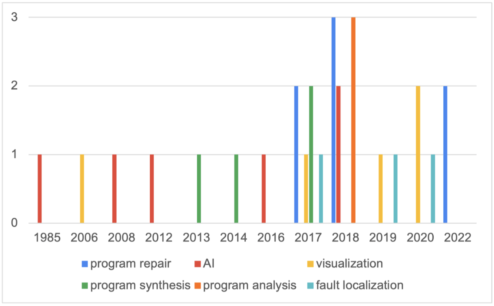

## 📑 논문 기본 정보
**Survey on Intelligent Tutoring System for Programming Education**, in Proceedings of Korea Conference on Software Engineering (KCSE2023)
> **Journal**: 2023 한국 소프트웨어공학 학술대회 (KCSE 2023)   
> **Korean Title**: 프로그래밍 교육을 위한 지능형 튜터링 시스템 문헌 조사   
> **English Title**: Survey on Intelligent Tutoring System for Programming Education   
> **Author**: Na, 서주은, Nam   
> **Citation**: VOL 25 NO. 01 PP. 206 ~ 213 2023. 02   

<br><br><br>

## 📚 프로그래밍 교육을 위한 지능형 튜터링 시스템 문헌 조사   
컴퓨터 과학 기술이 발전함에 따라 컴퓨터를 활용한 학습 시스템 (Intelligent Tutoring System, ITS)에 대한 연구가 활발히 이어지고 있다. 프로그래밍 교육을 위한 IPT (Intelligent Programming Tutor) 사례 조사에 대한 기존의 연구들은 기술에 초점을 맞춰 진행되었으며, IPT의 성능에 관하여 논의하였다. 하지만, 피교육자에게 직접적인 영향을 주는 것은 피드백이기에 학습 효과를 극대화하기 위해서는 피드백 형식과 내용에 대한 연구가 필요하다. 따라서 본 연구는 교육학 및 컴퓨터 공학에서 무분별하게 사용되는 ITS의 개념과 용어를 정리하고, IPT에 대한 연구들을 수집하여 피드백 관점에서 분석한다. 이를 통해 ITS와 IPT의 정의를 확립하며, 4개의 범주화된 피드백 종류를 새롭게 제안한다. 또한 IPT의 피드백 생성 방법과 기술 발달 사이의 관계성을 분석하여 IPT 연구의 방향성을 논의한다.   

<br><br>

## 🌳 Problem Definition

컴퓨터 과학 기술이 발전함에 따라 **컴퓨터를 활용한 학습 시스템 (ITS)에 대한 연구가 활발히 진행**되고 있다. 이때, 교육학 및 컴퓨터공학 분야에서 ITS 연구가 동시다발적으로 이루어짐에 따라 <span style='background-color: #FFE6E6'>**ITS의 개념과 용어가 무분별하게 사용되고 있음**</span>을 확인하였다.   

**프로그래밍 교육을 위한 ITS**는 독립적인 연구 분야로서 자리 잡으며, <u>**IPT로 분류**</u>되었다. IPT에 대한 **기존 연구들은 기술에 초점을 맞춰 진행**되었기에 IPT의 성능을 주로 다루었다. 따라서 IPT 분야는 <span style='background-color: #FFE6E6'>**효과적인 피드백에 대한 분석과 연구가 부족하다는 한계**</span>를 지닌다.   

이러한 한계점을 극복하기 위해 본 연구는 ITS의 개념 및 용어를 정리하고, 기존 IPT 연구 논문들을 수집하여 피드백 관점에서 분석하였다. 더 나아가 4개의 범주화된 피드백 종류를 새롭게 제안하였다.   

<br><br>

## 🪵 Approach & Result

### 🌿 ITS 정의 확립 및 개념 정리

ITS 기술의 등장과 발전 과정을 중심으로 용어와 개념을 정리하였다!

1️⃣ **CAI <span style="color: #808080">(Computer-assisted Instruction)</span>**   
노트북, 태블릿 PC, 스마트폰 등의 <u>**전통적인 컴퓨터 및 모바일 장치를 사용하여 피교육자에게 교육 콘텐츠를 제공하는 교육 방법**</u>을 의미한다. 컴퓨터는 단순히 도구적인 가치만을 지니며, 교사와 피교육자 사이의 중간 매개체 역할을 한다. CAI는 <span style='background-color: #fff5b1'>**피교육자의 학습 상태를 실시간으로 분석하여 즉각적인 도움을 제공하지 못한다는 한계**</span>가 있다.   
    
2️⃣ **ITS <span style="color: #808080">(Intelligent Tutoring System)</span>**   
기존의 <u>**CAI 방법에 AI 기술을 적용하여 자동화 및 맞춤화된 학습을 제공하는 교육적 소프트웨어**</u>이다. 피교육자의 학습 효과를 향상시키기 위해 개개인에게 맞는 교육 콘텐츠와 피드백, 상호작용을 지원한다. ITS는 수학 교육, 과학 교육, 언어 교육 그리고 컴퓨터 프로그래밍 교육 등 다양한 분야에서 활용된다. 그 중 <span style='background-color: #fff5b1'>**컴퓨터 과학 분야의 교육에서 가장 많이 사용**</span>되고 있다.   
    
3️⃣ **IPT <span style="color: #808080">(Intelligent Programming Tutor)</span>**   
<u>**컴퓨터 프로그래밍 교육을 위한 ITS 기술**</u>을 의미한다. IPT는 프로그래밍 초보자에게 컴퓨터 프로그래밍을 가르칠 때 생기는 어려움을 해결하고자 한다. 학생이 제출한 <span style='background-color: #fff5b1'>**프로그램 속 결함을 찾아 적절한 피드백을 자동으로 제공하는 것이 궁극적인 목표**</span>이다.

<br>

### 🌻 피드백 관점에서 IPT 연구 분석

1️⃣ **사례 조사 연구 수집**   
구글의 학술 검색 사이트 ([Google Scholar](https://scholar.google.com/))와 기존 사례 조사 연구들의 참고 문헌을 통해 논문 조사를 진행하였다.   

2️⃣ **IPT 연구 선별**   
Paiva et al.이 제시한 컴퓨터공학의 교육 분야를 기준으로 **ITS가 해당 분야들 중 일부를 다루고 있다면 IPT 연구로 판단**하였다. 피드백으로 <u>**문제 번호, 단원 이름 등의 학습 정보 또는 취득 점수만을 제공하는 연구들은**</u> 학생의 이해 정도 및 학습 능력을 고려한 피드백을 제공했다고 보기 어렵기에 <u>**IPT 분석 작업에서 제외**</u>하였다. 총 63편의 IPT 연구 논문을 수집하였고, 피드백 분석이 불가능한 6개의 논문을 제외한 **57편의 연구 논문을 분석 대상으로 선정**하였다.
    
3️⃣ **피드백 형식에 따른 분류**   
IPT 연구들의 피드백을 분석하여 **4개의 범주화된 피드백 형식인 <span style='background-color: #FFE6E6'>결함코드 (B)</span> / <span style='background-color: #FFE6E6'>수정코드 (F)</span> / <span style='background-color: #FFE6E6'>자연어 설명 (N)</span> / <span style='background-color: #FFE6E6'>시각적 자료 (V)**</span>을 새롭게 제안하였다. 수집한 IPT 연구들이 제안하는 복잡한 피드백 제공 방식을 B, F, N, V의 결합으로 표현하였다. **총 57편의 IPT 연구 논문들을 12개의 피드백 형식에 따라 분류 및 분석**하였다.   

4️⃣ **연구 결과**   
☁️ <u>**4개의 피드백 종류를 기준으로 분류</u> <span style="color: #808080">(피드백 조합 고려 X)**</span>   
IPT 기술에서 가장 많이 지원하는 피드백 형식을 쉽게 확인할 수 있었다. <span style='background-color: #fff5b1'>**자연어 기반 피드백 (N)이 가장 많이 제공**</span>되었으며, 수정된 코드 피드백 (F)이 뒤를 이었다.   

🌤️️ <u>**12개의 피드백 종류를 기준으로 분류</u> <span style="color: #808080">(피드백 조합 고려 O)**</span>   
<span style='background-color: #fff5b1'>**자연어 설명 (N)만을 피드백으로 제공하는 IPT가 가장 많았으며**</span>, **수정코드(F)만을 피드백으로 제공하는 연구가 두 번째**로 많았다. 결함코드 (B)를 제공하는 IPT 중 대부분이 다른 종류의 피드백을 함께 지원함을 관찰하였다. 이로써 <span style='background-color: #fff5b1'>**결함코드 (B)는 피드백에서 부수적인 정보로 사용됨**</span>을 알 수 있었다. 피드백의 조합을 분석한 결과, <span style='background-color: #fff5b1'>**결함코드 (B), 수정코드 (F), 시각적 자료 (V) 피드백 모두 자연어 설명 (N)과 가장 많이 결합됨**</span>이 확인되었다.   

<br>

### 🍁 논문 키워드 분석을 통한 IPT 연구 동향 파악
IPT 분야의 연구 동향을 파악하기 위해 수집한 연구 논문들의 키워드를 전처리 후 분석하였다. 그 결과, **IPT 연구에 적용된 기술을 6개의 범주 <span style="color: #808080">(Program repair / AI / Visualization / Program synthesis / Program analysis / Fault localization)</span>로 분류**할 수 있었다. 연구 논문들을 연도별로 집계하여 추가적인 분석을 진행하였다. 2015년도에 활발히 연구되었던 Program repair 기술이 IPT에 적용되기 시작한 시점은 2017년임을 관찰하였다. 이를 통해 <span style='background-color: #fff5b1'>**기술의 발달 및 연구 시점과 해당 기술의 적용 시점에는 시간적 차이가 있다**</span>는 결론을 도출할 수 있었다.   



<br><br>

## 🏕 Conclusion
본 연구는 CAI의 등장부터 ITS의 시작 및 발전까지 컴퓨터가 교육에 도입된 역사 흐름을 따라 ITS를 정의하고 IPT 개념을 확립하였다. 이를 통해 <u>**경계가 분명하지 않았던 ITS-IPT 정의와 개념, 목적을 정리**</u>하였다. 또한 **새롭게 제안한 4개의 피드백 형식을 기반으로 총 57편의 IPT 사례 연구 논문을 분석**하였다. <u>**자연어 설명 (N)이 프로그래밍 교육의 피드백에서 중요한 역할**</u>을 하고 있음을 알 수 있었다. 마지막으로, 수집한 연구 논문들의 키워드를 분석하여 기술의 발달과 IPT 연구 사이의 관계성을 발견하였다. 기술의 발달과 적용 시점 사이 시간적 차이가 있다는 현상을 관찰할 수 있었다. 현재 활발히 연구 중인 <u>**생성형 AI 기술과 APR (Automated Program Repair) 기술이 추후에 IPT와 결합되어 연구될 수 있을 것**</u>이라 기대한다. 앞으로의 IPT 연구가 효과적이고 정확한 피드백 생성에 초점을 맞춰 확장된다면 더 높은 교육적 가치를 지닌 IPT 시스템이 개발될 것이다. 

<br><br>

## ✨ 논문을 직접 읽어보고 싶다면!
본 연구에 대한 논문은 **2023 한국 소프트웨어공학 학술대회**에 정식 게재되었다. 아래 링크를 통해 **_프로그래밍 교육을 위한 지능형 튜터링 시스템 문헌 조사_** 논문을 다운로드 할 수 있다!   
[>> 프로그래밍 교육을 위한 지능형 튜터링 시스템 문헌 조사 (KCSE 2023)](./KCSE2023_Survey_on_Intelligent_Tutoring_System_for_Programming_Education.pdf)


```toc

```
