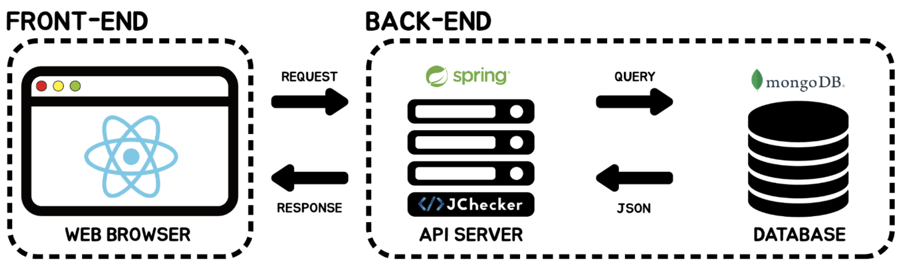
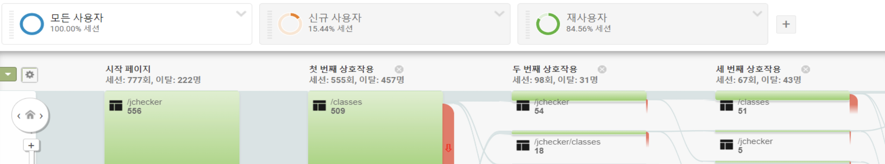

## 📑 논문 기본 정보
**Automatic Evaluation System for Object-Oriented Programs**, in Proceedings of Korea Computer Congress (KCC2022)   
> **Journal**:  한국정보과학회 2022 한국컴퓨터종합학술대회 (KCC 2022)   
> **Korean Title**: 객체 지향 프로그램 자동 평가 시스템   
> **English Title**: Automatic Evaluation System for Object-Oriented Programs   
> **Author**: 서주은, Choi, Kim, Nam   
> **Citation**: VOL 49 NO. 01 PP. 1755 ~ 1757 2022. 06   

<br><br>

## 📚 객체 지향 프로그램 자동 평가 시스템
본 연구에서는 새로운 객체 지향 프로그램 자동 평가 시스템을 제안함으로써 사용자의 프로그램 설계 능력과 객체 지향 개념에 대한 이해도를 향상시키고자 한다. 이를 위해 대표적인 객체 지향 프로그래밍 언어인 Java를 이용한 코딩 테스트 및 프로그래밍 과제를 채점할 수 있는 프로그램 분석 웹 서비스 jChecker를 설계 및 구현하였다. 그 결과, 채점자는 물리적인 채점 시간을 크게 단축할 수 있었고 코드 제출자는 피드백을 반영하여 객체 지향 개념을 코드에 적절히 적용할 수 있게 되었다.

<br>

### 🌳 Problem Definition

코딩 테스트 및 과제를 자동으로 채점하는 기존의 프로그램들은 대부분 **테스트 케이스만을 기반으로 작동**한다. 실제로 **_Repl.it_**, **_WebCat_** 등과 같은 채점 서비스는 특정 Input 값에 대한 Output 값이 정답과 일치하는지 확인하여 코드를 평가한다. 이때, 제한된 자원으로 <U>**정확도 및 완성도가 높은 테스트 케이스를 생성하는 데에는 많은 어려움**</U>이 있다.   

이를 해결하기 위해 기존의 논문들은 자동 채점 시스템에 다음의 기술을 적용하였다.   
> [Formal Semantics](https://par.nsf.gov/servlets/purl/10087529): 의미적으로 다른 실행 경로를 탐색  
> [Hyper-safety Verification](https://kumarmadhukar.github.io/papers/nier-icse2020-hyper.pdf): 소스코드 자체의 정확성을 평가   

두 기술은 프로그램의 출력값만 비교하는 것이 아닌, 소스코드 자체를 분석하는 채점 방식을 제안했기에 의의가 있다.

하지만, 테스트 케이스만을 고려하는 채점 방식은 <span style='background-color: #FFE6E6'>**각 프로그래밍 언어의 고유한 특성을 반영하지 못한다는 한계**</span>를 지닌다. 객체 지향 등 언어의 특성을 고려할 수 있는 프로그램 채점 방식에는 어떤 것이 있을까 🤔

이러한 한계점을 극복하기 위해 객체 지향 프로그램을 자동으로 평가하는 시스템 jChecker를 개발하였다. 이로써 Java 언어가 가지는 고유의 특성인 객체 지향 개념에 대한 사용자의 이해도를 향상시키고자 하였다.

<br>

### 🪵 Approach

기존의 자동 채점 시스템이 가지는 한계점을 극복하기 위해 <span style='background-color: #FFE6E6'>**객체 지향 개념 검사를 지원하는 자동 채점 엔진 기반의 웹 서비스 jChecker**</span>를 새롭게 제안한다!

jChecker는 채점자가 <U>**테스트 케이스와 객체 지향 개념을 채점 기준으로 웹 페이지에 입력하면 이를 기반으로 프로그램을 자동 평가**</U>한다. 사용자가 제출한 프로그램 코드는 엔진 단계에서 <U>**Abstract Syntax Tree (AST)를 통해 구문 분석 과정**</U>을 거치며, 채점 시 Node 정보를 활용하여 객체 지향 개념의 구현 여부를 확인한다.

> - 채점자가 작성한 **채점 정책을 기준으로 프로그램 자동 평가**   
> - 채점 정책 중 테스트 케이스를 사용하여 **테스트 케이스 기반의 채점 진행**   
> - AST 구문 분석 후 AST node 정보를 통해 **객체 지향 개념의 구현 여부 확인**
> - 테스트 케이스 실행 결과, 객체 지향 개념 평가 결과를 **자연어 피드백으로 제공**

#### 🌿 시스템 구조
* <U>**백엔드**</U>는 API 서버이며, 프론트엔드와 데이터베이스의 중간 다리 역할로서 채점 요청이 오면 채점을 진행하여 데이터베이스에 결과를 저장
* <U>**프론트엔드**</U>는 **<sup>1</sup>사용자가 서버의 리소스를 필요로 하는 경우**와 **<sup>2</sup>사용자가 프론트엔드에서 정보를 입력하여 저장하는 경우**에 대한 요청을 처리
* <U>**데이터베이스**</U>는 백엔드의 요청에 맞게 채점 관련 데이터를 저장 및 반환



#### 🌻 자동 채점 엔진 동작 및 흐름  
**1️⃣ Preprocessing <span style="color: #808080">(전처리)</span>**   
사용자가 채점 대상 프로그램을 압축 파일 (.zip 확장자) 형식으로 제출하면, Java 라이브러리를 사용하여 정해진 경로에 압축을 해제한다.   

**2️⃣ Compile and Execute <span style="color: #808080">(테스트 케이스 기반 채점)</span>**   
압축이 해제된 코드를 채점자가 지정한 컴파일 방법에 따라 컴파일 한다. 채점 정책에 등록된 테스트 케이스를 실행함으로써 제출된 프로그램이 의도에 맞게 동작하는지 확인한다.   

**3️⃣ <span style='background-color: #fff5b1'>Abstract Syntax Tree</span> <span style="color: #808080">(객체 지향 개념 구현 평가)</span>**   
Eclipse JDT 라이브러리의 **_ASTParser_** 를 사용하여 구문 분석을 진행한다. 채점 정책에 따라 필요한 AST node 정보를 수집하고 분석한다.   
> 💡 **객체 지향 개념 구현 평가 예시 (Inheritance)**   
> TypeDeclaration의 **_getName()_** 을 통해 구현되어야 하는 **하위 class가 존재하는가 확인**   
> TypeDeclaration의 **_getSuperclassType()_** 을 사용하여 **특정 상위 class의 상속 여부 확인**   
> **상위 class와 하위 class가 채점 기준을 만족하면 Inheritance가 적절히 구현되어 있다고 평가**   

**4️⃣ Check Result <span style="color: #808080">(결과 확인)</span>**   
채점 결과를 JSON 형태로 반환한다. 마감 기한을 넘긴 지연 제출 여부를 추가적으로 확인 후 채점 결과에 반영한다.   

<br>

### 🏕 Result
프론트엔드에 Google Analytics 코드를 추가로 작성하여 웹 페이지에 접속한 사용자의 흐름을 분석하였다.   

클래스 페이지 (/classes)가 상호작용에 지속적으로 등장함을 알 수 있다. 이는 사용자가 해당 페이지에서 여러 번의 채점을 시도하고 있음을 의미한다. 즉, 사용자는 제공된 피드백을 반영하여 반복적으로 프로그램을 수정 및 확인할 수 있는 것이다.   

jChecker는 테스트 케이스 기반의 채점 방식과 함께 <span style='background-color: #fff5b1'>**새로운 객체 지향 개념 평가 방법을 제안함**</span>으로써 기존 채점 시스템이 가진 문제점을 극복하였다. 본 연구의 효과 및 결과는 크게 <U>**사용자 입장**</U>과 <U>**채점자 입장**</U>으로 나누어 살펴볼 수 있다.

#### 👩🏻‍💻 사용자 입장

- jChecker 서비스가 제공하는 피드백을 통해 자신의 코드를 직관적 (직접적, 사실적)으로 확인 가능
- 피드백을 바탕으로 코드를 수정하여 반복적으로 채점 시도 가능
- 객체 지향 개념에 대한 자신의 이해 정도를 확인 가능

#### 👩🏻‍🏫 채점자 입장

- 많은 수의 제출물을 수동으로 실행하지 않고 jChecker의 결과를 점수에 반영함으로써 채점 시간 단축
- 객관적이고 정확한 평가 결과를 제공 가능

아래 링크를 통해 본 연구의 결과물 jChecker를 직접 사용해볼 수 있다!   
[http://isel.lifove.net/jchecker](http://isel.lifove.net/jchecker)

<br>

### ✨ 논문을 직접 읽어보고 싶다면!
본 연구는 **한국정보과학회 2022 한국컴퓨터종합학술대회**에 정식 게재되었다. 아래 링크를 통해 **_객체 지향 프로그램 자동 평가 시스템_** 논문을 다운로드 할 수 있다!   
[>> 객체 지향 프로그램 자동 평가 시스템 (KCC 2022)](./KCC2022_Automatic_Evaluation_System_for_Object-Oriented_Programs.pdf)


```toc

```
