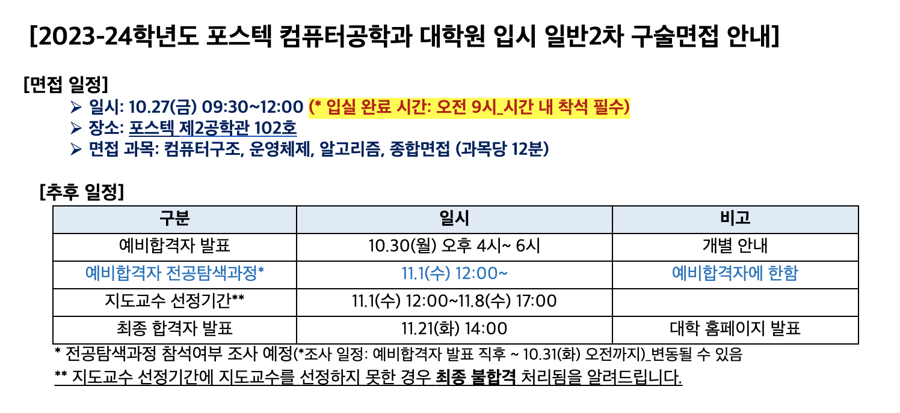

## ✏️🥔 글 잘 쓰는 감자 되기

대학원은 성적 관리만 잘하고 자기소개서만 잘 쓰면 갈 수 있는 곳이라고 생각해왔다.   
물론 나의 아주 크고 오만한 착각이었다 ㅎ..ㅎ   
자기소개서 작성, 면접 및 전공 시험 공부, 각종 연구 실적 자료 등 준비할 것이 꽤 많았다.   

대학원 지원을 위해 **가장 먼저 시작했던 것은 자기소개서 작성**이었다.   
자기소개서를 작성하면서 4년의 학부 생활을 크게 정리할 수 있을 것이라 생각했기 때문이었다.   
여러 자기소개서 양식을 살펴본 후 가장 어렵다고 느꼈던 대학원은 포항공대 대학원..!   
대부분의 타 대학원 양식은 지원 동기, 기억에 남는 학부 경험, 희망 연구 분야 등을 서술하는 것이었다.   
반면, 포항공대 대학원의 자기소개서 양식은 아래와 같았다. <span style="color: #808080">(연구계획서도 있지만, 무난하게 작성 가능하다고 생각한다!)</span>

1. **성공적인 삶**이 무엇이라고 생각하는지 **자아실현**과 **공동체기여**라는 두 측면에서 기술 
2. **성공적인 삶을 살아가기 위해** 포항공과대학교 대학원에서의 **학위과정이 어떤 의미하는지**에 대해 기술 (어떠한 노력을 해 왔으며 앞으로 어떠한 노력을 할 것인지)

성공적인 삶이요..? 자아실현? 공동체기여?? 😳   
자기소개서 문제를 확인하고 엄청난 고민에 빠졌다...   
'성공이란 무엇인가', '자아실현은 또 무엇인가' 평소에는 깊게 고민하지 않았던 약간의 철학적인..? 질문들이었다.   


<br><br>

### 🎠 성공적인 삶이란?!
나만의 '성공적인 삶'을 정의하기 위해 '성공'이란 무엇인지 어학사전에 검색했다.   
**'목적하는 바를 이룸'** 생각보다 간단 명료한 의미를 보고 영감이 떠올랐다.   
> _**성공적인 삶이란 목표한 것을 이루어 가는 삶**이라고 생각합니다. 크고 작은 목표들을 세우고 노력하는 과정에서 성장하는 자신을 발견할 수 있기 때문입니다._   

첫 문장이 해결되니, 뒤에 이어지는 내용들은 비교적 쉽게 적을 수 있었다.   
**'목표'** 를 주요 키워드로 삼아, **개인적인 목표**와 **대의를 위한 목표**를 중심으로 글을 작성했다.   
대학 생활 4년 중 나의 가장 큰 목표는 무엇이었는가, 한 공동체에 속한 구성원으로서의 목표는 어떠했는가 고민했다.   
세웠던 목표들을 위한 노력 그리고 결과를 정리했다.   
개인적인 목표와 그에 대한 노력은 자아실현으로, 대의를 위한 목표와 노력은 공동체기여로 풀어나갔다!   

<br>

1️⃣ **<u>개인적인 목표</u> <span style="color: #808080">(자아실현)</span>**   

> _컴퓨터공학을 공부하는 사람으로서 저의 궁극적인 목표는 **넓은 시야와 실력을 갖춘 연구자가 되는 것**입니다._   

나의 목표를 위한 노력으로 **능동적으로 공부했던 학업적 경험**, **적극적으로 문제를 탐색하고 해결하고자 했던 연구적 경험**을 언급했다.   
좋은 학점과 연구실 활동, 2022 한국컴퓨터종합학술대회에 냈던 논문 등이 나의 이야기를 뒷받침 해주었다.   

<br>

2️⃣ **<u>공동체를 위한 목표</u> <span style="color: #808080">(공동체기여)</span>**   

> _사회 구성원으로서의 목표는 **세상을 이롭게 바꾸는 연구를 하는 것**입니다._   

공동체에 기여했던 경험으로 **다양한 전공 과목의 TA 활동**과 **캡스톤 프로젝트**를 작성했다.   
조교로서 학생들과 함께 문제를 해결했던 시간, 캡스톤 프로젝트를 통해 Java 프로그래밍 수업에서 겪는 어려움을 해소하고자 했던 노력을 중심으로 내용을 채워나갔다.   

<br><br>

### 🎢 학위 과정의 의미?!   

>_포항공과대학교 대학원에서의 학위과정은 **성공적인 삶을 위한 새로운 시작이며 성장의 기회**가 될 것이라 기대합니다._

포항공대 대학원 학위 과정이 갖는 의미에 대한 부분은 매우 간단하게 작성했다.   
약 5문장을 통해 앞에서 언급한 내용들을 요약하고, '목표한 것을 이루어 가는 삶'이라는 주제를 마무리 하고자 했다.   

<br><br><br>

## 📑🥔 서류 잘 제출하는 감자 되기

자기소개서와 연구계획서 외에도 **기타 서류들을 제출**해야 한다!   
필수는 아니지만, 나의 우수성을 입증하기 위해 최대한 모든 자료와 서류를 끌어 모았다 🙄   
(제출 당시 마음은 거의 우수성을 호소하는 심정이었던...🙊 제발 알아주세요..!)

<br>

1️⃣ **<u>연구 실적 목록</u>**   
'논문 (국내외 학술지 및 학술회의)' 항목을 작성 후 제출했다.

   

   

<br>

2️⃣ **<u>연구 실적 증빙 자료 요약본</u>**   
두 편의 논문과 각 논문의 페이지 번호가 나와 있는 목차 페이지를 하나의 파일로 만들었다.   
목차 페이지에는 나의 논문 제목에 별도로 하이라이트 표시를 했다!   
- KCC 2022 논문집 목차 한 페이지 + 발표게재지 및 페이지 번호가 나온 논문 원본 **<span style="color: #808080">(객체 지향 프로그램 자동 평가 시스템)</span>**
- KCSE 2023 논문집 표지 + 목차 한 페이지 + 발표게재지 및 페이지 번호가 나온 논문 원본 **<span style="color: #808080">(프로그래밍 교육을 위한 지능형 튜터링 시스템 문헌 조사)</span>**   

<br>

3️⃣ **<u>기타 우수성 입증 자료</u>**   
상장, 각종 이수증 등을 제출함으로써 서류로 남았던 모든 학교 생활을 보여주고자 했다.   
제출한 우수성 입증 자료는 아래와 같다!   
- 2022 한국컴퓨터종합학술대회 학부생 부문 우수상
- 2022 한국컴퓨터종합학술대회 논문 발표 포스터
- 2023-1 전산전자공학부 캡스톤 페스티벌 최우수상
- 캡스톤 프로젝트 판넬 포스터
- 2023-1학기 캡스톤 디자인 수행 보고서 요약본
- 국가 우수 (이공계) 장학금 장학 증서
- 국가 장학생 증명서<span style="color: #808080">: 이공계 우수 장학금을 지속적으로 받았음!</span>
- 재학 성적 우수 장학금 선발 내역 <span style="color: #808080">(4년 내내)</span>
- K-MOOC 파이썬 프로그래밍 과정 이수증
- 빅데이터 혁신융합대학 마이크로디그리 과정 이수증
- 2023-TOPCIT 상반기 정기 평가 장려상
- TA 담당했던 과목 강의계획서 5장 <span style="color: #808080">(조교 활동)</span>   

<br>

기타 서류까지 제출하면 1차 서류 평가를 위한 준비는 끝난다!   
1차 서류 제출 마감 후 한 달의 시간이 넘게 흘렀다.   
**서류 통과의 소식과 함께 면접 안내 메일**을 받았다.   



<br>

면접 과목이 4개인데, 각 과목 12분? 당황스러웠다.   
서류 합격의 기쁨은 전혀 누리지 못했다. (메일을 받은 주에 곧바로 중간고사가 시작되었기 때문..ㅎ)   
**메일을 받은 날로부터 약 2주 후에 면접**이었다.   


<br><br><br>

## 💬🥔 면접 잘 보는 감자 되기

대학원 준비를 학업과 병행하다 보니, 정신을 차렸을 땐 면접까지 8일이 남은 시점이었다 😞   
내가 지원한 포항공대 컴퓨터공학과 대학원은 **컴퓨터구조**, **운영체제**, **알고리즘** 이렇게 세 과목을 시험 과목으로 지정했다.   

<br>

### 🫥 구술 면접 준비
✨**첫 1일은 기출 문제 풀이**, **다음 2일은 컴퓨터구조**, **그 다음 2일은 운영체제**, **또 다음 2일은 알고리즘**, **마지막 하루는 종합 면접 준비**✨ 라는 그럴 듯한 계획을 세운 뒤 실행에 옮겼다!   

<br>

1️⃣ **<u>기출 문제 풀이</u>**   
포항공대 컴퓨터공학과 대학원에 요청하면, **이메일로 그동안의 전공 시험 기출 문제를 제공** 받을 수 있다.   
세 과목 모두 2021-1학기 입시 기출 문제부터 2023-1학기 입시 문제까지 받을 수 있었다.   
직전 학기인 2023-1학기 문제를 제외한 나머지 기출 문제들은 모두 필기 시험 문제였기에 가볍게 넘겨버렸다!!

#### 🖍️ 2023-1학기 기출 문제 풀이를 보고 싶다면!
나의 상황에 맞게 2023-1학기 기출 문제들만 꼼꼼히 보았다.   
아래 링크를 통해 내가 공부하며 작성한 풀이 (정답이 아닐 수도 있지만!!)를 다운로드 할 수 있다!   
[>> 2023-24학년도 일반1차 대학원 입시 구술 시험 문제](./postech_cse.pdf)   

<br>

2️⃣ **<u>컴퓨터구조</u>, <u>운영체제</u>, <u>알고리즘</u>**   
가장 자신 없는 과목은 운영체제였다..!   
컴퓨터구조와 알고리즘은 모두 조교를 여러 번 담당했던 과목이라 익숙했지만, 운영체제는 2022-1학기에 수업을 들은 것이 전부였다.   
운영체제를 보다 효율적으로 복습하기 위해 **_"혼자 공부하는 컴퓨터구조 + 운영체제"_** 라는 책을 공부했다.   
기본적으로 수업 PPT와 나의 필기들을 참고하며, 구술 시험 준비를 했다.   

<br>

3️⃣ **<u>종합 면접 준비</u>**   
종합 면접이 무엇을 위한 면접인지 감이 잡히지 않아, 편하게 **인성 면접이라고 생각**했다 🤓   
그동안 썼던 논문들과 진행했던 프로젝트들을 정리했으며, 자기소개서 및 연구계획서를 꼼꼼하게 읽어보는 시간을 가졌다!   
마지막으로 이전에 풀었던 기출 문제들을 구술 면접에 맞게 말하며 연습했다.   

<br><br>

### 😐 구술 면접 후기
오전 면접을 배정 받았던 나는 면접 당일 오전 9시까지 정해진 장소에 입실해야 했다.   
면접 장소인 제2공학관 문을 열자, 제일 먼저 보였던 것은 '인성 면접 대기실' 안내판이었다 😦   
누군가 포항공대 과잠을 입고 들어가는 것을 보았다.. 부러웠다!!   
'구술 면접 대기실'을 찾아 건물 안쪽으로 더 들어갔다.   

시간이 되고, 학과 사무실 선생님들이 전자기기를 모두 수거하셨다.   
앞에 있는 커다란 스크린에는 약 20명의 면접 시간표가 나오고 있었다.
나를 포함하여 면접자 4명이 바로 면접을 보기 위해 안내를 받았다.   

면접은 총 4개의 교실에서 동시에 이루어졌다.   
각 방의 문에는 '컴퓨터구조, '운영체제', '알고리즘', '종합 면접' 안내 종이가 붙어 있었다.   

나는 **종합 면접 → 컴퓨터구조 → 운영체제 → 알고리즘** 순서대로 면접을 보았다.   
각 과목의 교실에는 두 분의 교수님이 앉아 계셨다.   

<br>

#### 1️⃣ **종합 면접**
- **그동안 경험했던 프로젝트 중 가장 자신있는 프로젝트 설명** <span style="color: #808080">▷ 캡스톤 프로젝트에 대해 설명했는데, 굉장히 좋아하셨다!</span>
- **캡스톤 프로젝트에 대한 추가 질문** (역할, 어려웠던 점 등) <span style="color: #808080">▷ 예상했던 질문들이라 무난하게 대답했다!</span>
- **Java, Python, C언어 프로그래밍 지식에 대한 질문** (객체 지향 개념, 특정 조건에서의 프로그래밍 방법 등) <span style="color: #808080">▷ Java, Python은 모두 조교 경험이 있기에 익숙하여 모두 대답했다! C언어의 Union 질문은 대답하지 못했다.. 마지막에 교수님께서 흡족한 표정으로 '오.. 잘하는데? 꼭 다시 봅시다.' 라고 하셨다.</span>

<br>

#### 2️⃣ **컴퓨터구조**
- **Direct Mapped Cache, Fully-associative Mapped Cache, Set-associative Mapped Cache 설명** <span style="color: #808080">▷ 공부했던 내용이라 무난하게 대답했다!</span>
- **Fully-associative Mapped Cache의 Tag Search 알고리즘 설명** <span style="color: #808080">▷ 잘 기억이 나지 않아서 해당 Cache의 하드웨어 구조를 바탕으로 설명했다. 이때 시간이 굉장히 오래 걸렸다..</span>
- **Cache Miss 세 가지 원인 설명** <span style="color: #808080">▷ 기출 문제에 있었던 질문이라 공부한 내용 그대로 대답했다.</span>   

<br>

#### 3️⃣ **운영체제**
의자 위에 영어가 빼곡히 적힌 종이 한 장이 놓여 있었다.   
자세히 보니 문제가 길게 적힌 종이였다.. (나는 그대로 정신줄을 놓았다ㅎ)   
가만히 서서 종이를 보고 있으니, 교수님께서 뒤에 있는 칠판에 문제를 풀라고 하셨다 😳   
문제를 확인한 순간부터 정신이 혼미해졌기에 정확히 기억이 나지 않는다,,,   
- **주어진 조건에서 CPU Scheduling 방법 중 3개를 적용하여 Process 실행 순서 설명 (정확하지 않지만 Process Priority, SJF, Round-Robin Scheduling이었던 것 같다)** <span style="color: #808080">▷ 주어진 조건 중 Process 도착 시간을 못 보고 설명한 탓에 교수님께서 '제대로 알고 있긴 한데, 도착 시간을 못 본 것 같아요'라고 하셨다.</span>
- **Virtual address를 Physical address로 변환** <span style="color: #808080">▷ 정확한 계산 식을 알지 못해 변환 단계만 설명했다..!</span>
- **아예 모르는 문제들 등장-⭐️** (기억도 나지 않는다 ㅎ..ㅎ)
- **File System 관련 질문** <span style="color: #808080">▷ 학부 수업 때 배우지 않아서 기본적인 내용만 설명했다!</span>

<br>

#### 4️⃣ **알고리즘**
이미 멘탈이 쿠크다스 마냥 부셔져버린 상태라 역시 기억이 잘 나지 않는다 🫠   
운영체제와 비슷하게 영어와 종이로 문제가 제공되었지만, 칠판은 사용하지 않았다.
- **Sorting 방법 중 4개를 주어진 배열에 적용 후 시간복잡도 계산 (4개 중 하나가 Insert Sort였던 것만 기억난다ㅎ)** <span style="color: #808080">▷ 적용하는 것까지는 성공! 그러나 시간복잡도가 기억이 나지 않아서 찍었다..</span>
- **기억은 나지 않지만 아는 문제와 모르는 문제가 섞여 있었다-⭐️** (Text 정렬 문제가 있었던 것 같다!)
- **Dijkstra 알고리즘의 기본 아이디어와 간단한 Pseudo Code, 장점 등 설명** <span style="color: #808080">▷ 시간복잡도는 기억 나지 않았다! 나머지는 무난하게 설명했다.</span>

<br>

면접이 끝난 후에도 오후 면접 시간이 되기 전까지 퇴실할 수 없었다.   
약 50분의 면접이 끝나니, 기운이 다 빠져서 힘이 없었다.   
면접을 시원하게 망친 것 같아 차라리 꿈이었으면 했다 🫢   
금요일 면접 후 바로 월요일 결과 발표였는데, 누가 나를 화요일까지만 기절시켜줬으면~ 했다.   


<br><br><br>

## 📨🥔 컨택 잘 하는 감자 되기
그렇다.. **합격이었다** 🙊  
아직 최종 합격은 아니었지만, 칼국수를 먹다 받은 메일에 엌! 소리가 나왔다.   

   

<br>

연구실 컨택을 위한 교수님 면담과 연구실 설명회를 위해 **'전공 탐색 과정'에 참가**했다.   
각 교수님마다 면담 가능한 시간을 사전에 메일로 안내받았고, **희망하는 연구실 교수님께 면담 신청 메일**을 드렸다.   
1분도 안되는 시간 안에 메일 알림이 울렸다!   
순조롭게 교수님과 면담 시간을 정한 뒤 다음날 포항공대로 향했다.   

   

   

<br>

약 1시간의 면담을 했다.   
교수님께서 나에 대해 궁금한 것들을 물어보셨고, 편한 분위기 속에서 긴장하지 않은 채 대답을 할 수 있었다!   
석사 과정으로 지원한 이유를 물으시며, 박사 과정까지 함께할 생각이 있다면 연락을 달라고 하셨다.   
시간을 내주신 교수님께 감사한 마음이 듦과 동시에 고민하던 것들에 대해 명쾌하게 답해주셔서 위로도 받았다 🙃   
나에게 주어진 시간이 일주일뿐이라 빠르게 고민한 후 메일을 드렸다.   
모든 것이 마무리 되는 순간이었다 ✨

   


<br><br><br>

## 🥔🍟 도비가 된 감자


```toc

```
