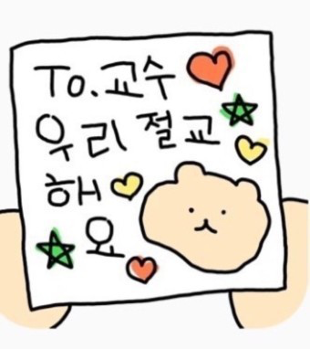
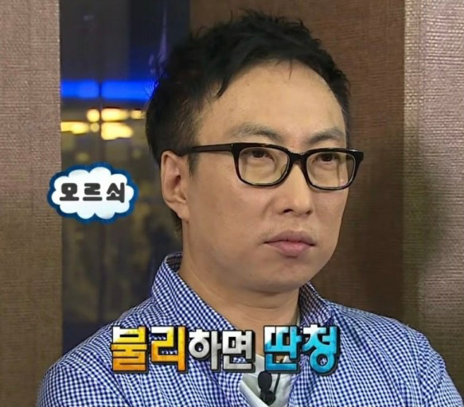

## 👻 말도 못하는 감자라구요..

2020년, 대학에 입학하며 꿈꿨던 4학년의 모습이 있었다.   
자신이 선택한 전공의 전문가로서 어딜 가나 '저의 전공은 ~입니다' **자신있게 이야기 할 수 있는 사람** 😎   
후배들이 전공 기초 내용들을 물어보면, **인터넷 검색이나 책 없이도 멋있게 대답할 수 있는 사람** 🥴   

멋쟁이 4학년이 되길 꿈꾸며 2학년과 3학년을 컴공생으로 보냈다.   
고등학생 때 문과를 공부했던 학생으로서 항상 어딘가 자신감이 없었기에 **남들보다 더 꼼꼼하게, 오래 앉아 공부하고자 했다!**   
오전 10시 전에 등교해, 다음날 새벽 6시에 연구실을 나와도 괜찮았다.
나도 훗날 므찐 4학년이 될 것이라 믿었으니까 🙏🏻   
매번 늦게 지는 달, 일찍 뜨는 해를 봐도 억울하지 않았다.   


<br>

그러나, 현실은 여전히 구선생님 (<span style="color:blue">**G**</span><span style="color:red">**o**</span><span style="color:#ffd33d">**o**</span><span style="color:blue">**g**</span><span style="color:green">**l**</span><span style="color:red">**e**</span> 최고!)이 없으면 그저 귀만 열린 감자였구,   
저번 학기는 커녕 어제 배운 내용도 쉽사리 잊어 버리는 4학년이었다.   
그렇게 늘 **'이대로 졸업해도 괜찮을까?'**, **'나는 과연 컴퓨터공학을 전공했다고 할 수 있을까?'** 생각하며 지냈다.   

다행히 성적은 나쁘지 않았다. 사실 좋은 편에 가까웠다.   
학기가 시작될 때마다 두려웠지만... 결국 나의 성적은 늘 A+이 많을까, A0가 많을까의 문제였다!   
나의 노력에 비례하는 결과들이 쌓여 가는 것을 보며, **이대로 계속 공부를 해도 좋겠다**고 생각했다.   

대학원을 꿈꾸는 길이 순탄한 것만은 아니었다.   

2학년 때 들었던 수업을 시작으로 하계 방학부터 **연구실에서 학부 연구생 활동**을 하였다.   
논문 작성 및 프로젝트를 비롯한 연구 경험이 있다는 것은 대학원을 지원할 때 많은 도움이 되었다.   
하지만, 연구실에 속하여 다양한 경험을 했던 시기가 개인적으로는 스스로 가장 작아졌던 때였다.   
나의 노력, 공부, 그에 대한 결과까지 인정 받지 못했던 날들이었다.   
내가 아닌 다른 사람들의 말에 휘둘려 나는 스스로 '연구를 하면 안되는 사람'이라고 생각하며 지냈다.   

그러던 중에 조교를 맡고 있던 수업의 교수님과 이야기를 나눌 시간이 있었다.   
교수님께서는 앞으로 졸업 후 진로에 대한 계획을 물으셨다.   
아직 고민 중이라는 나의 대답에 교수님은 '대학원 안 가려고?' 다시 물으셨다.   
잘 모르겠다며 얼버무리자, 짧지만 단호한 교수님의 대답이 돌아왔다.   
**'왜 고민하니?'** 이 한마디에 정신이 번쩍 들었다.   

<br><br>

## 💭 대학원을 꿈꾸다!

교수님의 간단 명료한 한마디가 모든 고민을 끝내는 데 도움이 되었다.   
납득이 안되는 다른 말들로 도전을 포기하기에는 지난 시간과 노력들이 아까웠다.   
그렇게 나는 4학년 1학기, 졸업 프로젝트를 마무리하는 시점 (연구실 탈출 시점)에 대학원 진학을 결심했다.   



<br>

4학년 1학기 여름, 나에게는 거의 처음으로 방학 다운 방학이 주어졌다.   
그동안 연구실 활동을 한다는 이유로 대부분의 방학을 학교에서 보냈기에 대학원 준비가 아닌 자유를 누리고 싶었다..!   
**정말 먹고 놀고 푹 자는 💤 아주 즐거운 방학을 보냈다!**   
거의 매일 엄마, 언니와 밖에 나가 맛집을 찾아다녔다 😋   
학교에 있을 때 엄마 집밥이 너무 그리웠는데, 생각해보니 집밥을 많이 안 먹은 방학이었다..ㅎ   
우리집 막냉이 고양이들과도 뒹굴뒹굴 나른한 시간들을 보냈다 😊 (사진은 드렁큰 냥이처럼 나왔지만, 실제로는 엄청 귀엽다는 사실!)   


<br>

시간이 날 때 틈틈이 대학원에 대해 고민하고 나름 조사를 했다.   
나에게는 나름대로 대학원 선택의 기준과 우선순위가 있었다.   

1. 진학하고자 하는 **대학원**이 어디인가
2. 해당 대학원의 어느 **연구실**에 진학할 것인가   

학부에 대한 아쉬움이 나름 있었던 터라, **공대로 유명한 대학원**에 진학하고자 하는 바람이 있었다.   
대학원을 정하는 게 우선이었고, 해당 대학원에 내가 희망하는 연구실이 있는지를 확인하였다.   
여러 지망 대학원 중 **포항공대**에 대한 마음이 가장 컸다.   
다른 대학원들은 원하는 연구실이 없거나, 이유 없이 끌리지 않았다 🙄   
포항공대는 이전 연구실 선배들이 진학한 곳이고, 지금의 대학과 같은 지역에 위치했기에 끌렸다.   
약 4곳으로 지망 대학원을 좁힌 뒤 각각의 대학원 지원에 필요한 것들을 정리했다.   

포항공대 대학원은 지원 시 공인영어시험 성적을 필요로 했다.   
지난 학기에 쳤던 시험 성적이 있었지만, 여유로운 마음으로 보면 더 잘 나올까 싶어서 방학 동안 토익 시험을 보았다.   

4년간 학업을 위해 어떤 노력을 했는지, 얼마나 다양한 전공 활동을 했는지 정리하는 시간도 가졌다.   
연구실에서 많은 것들을 경험했다고 생각했는데, 나열하고 보니 딱히 빛을 발하는 내용들은 없었다 😅  

학교생활을 정리하면 정리할수록 한없이 작아지는 나를 발견할 수 있었다..ㅎㅎ   
하지만! 나는 학점이 깡패니까 괜찮아~ 스스로를 다독이며 정신줄을 부여 잡았다.
<span style="color: #808080"> 과연 내가 깡패일까..? 일 수 있을까...? 이겠지? 그래야 할 텐데,,, 나 나름 괜찮게 살았는데? 아니었던 것인가... 왜 쓸 내용이 없는가,,, </span>



그렇게 심란함과 막막함이 눈 앞까지 다가오니 방학이 끝났다..!!


```toc

```
